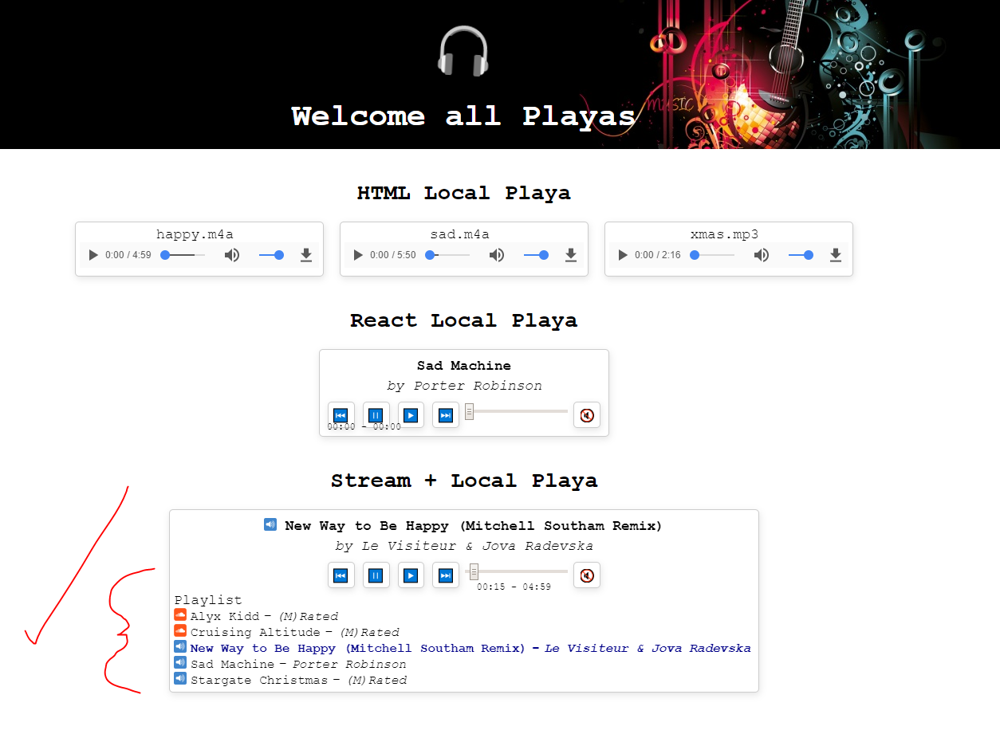

# MusicPlaya 🎶
HTML5-based, platform-agnostic playlist creator

## Goal
Using web technologies build a playlist editor that can play audio streams from multiple sources. e.g. YouTube, SoundCloud, Spotify, MixCloud

## References
https://www.w3schools.com/html/html5_audio.asp
https://github.com/captbaritone/winamp2-js/blob/master/js/media/elementSource.js

https://webdesign.tutsplus.com/tutorials/create-a-customized-html5-audio-player--webdesign-7081
https://tutorialzine.com/2015/03/html5-music-player
https://designmodo.com/audio-player/
https://realfavicongenerator.net/

Audio/Video DOM: https://www.w3schools.com/tags/ref_av_dom.asp

Media Events: https://developer.mozilla.org/en-US/docs/Web/Guide/Events/Media_events

# Results
Using HTML5 Audio can be quite easy but the main drawback in this project is the availablity of public APIs (or at least API keys/IDs). 

In this example I was able to create a simple HTML-based player, a React-based local file music player and a React-based Soundcloud + local file player. I ran out of time to attempt to integrate Spotify or YouTube or another source.

## Blockers
As mentioned above the main thing stifling progress on a project like this is API availability. Unfortunately, as most of these services rely on advertising money they are less inclined to provide easy access to their libraries. 

## Further work 
The original goal was met however I'd have preferred a Spotify + Soundcloud + YouTube player.